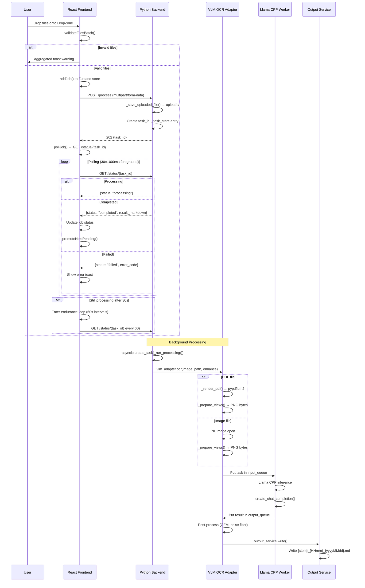
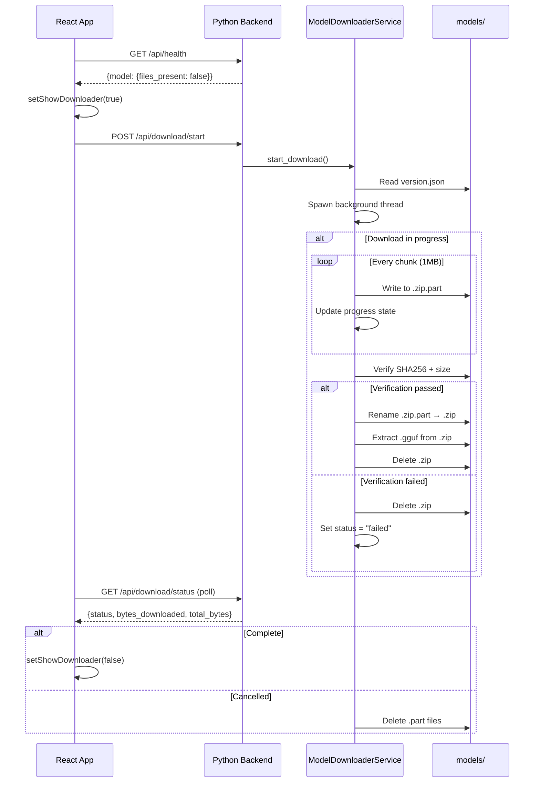
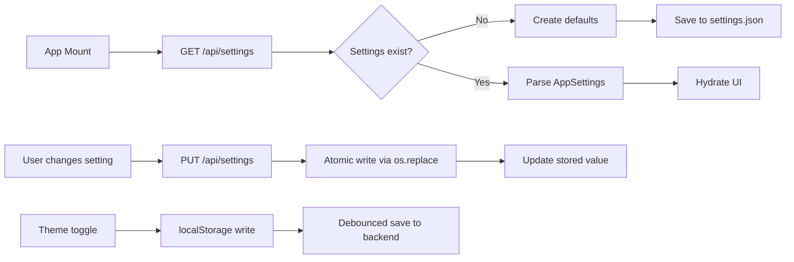
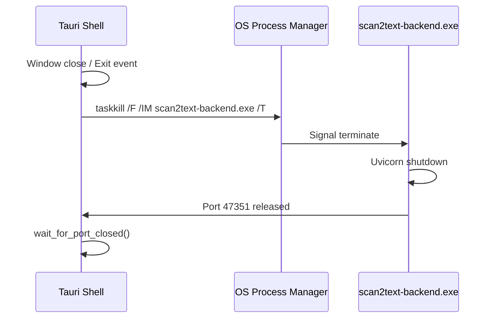
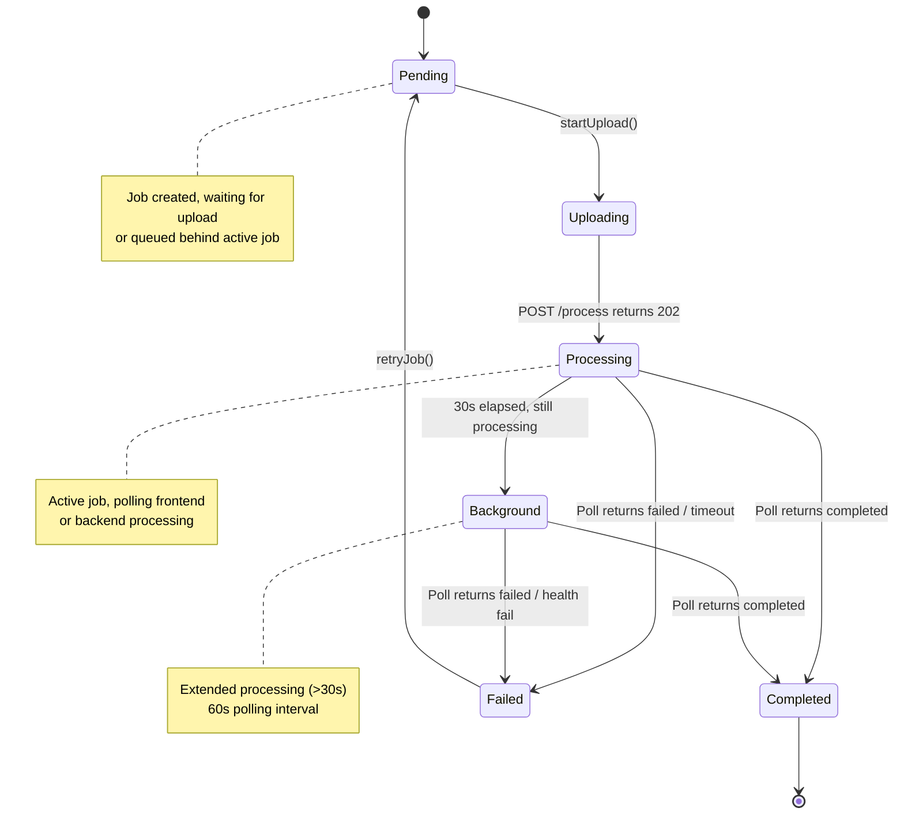
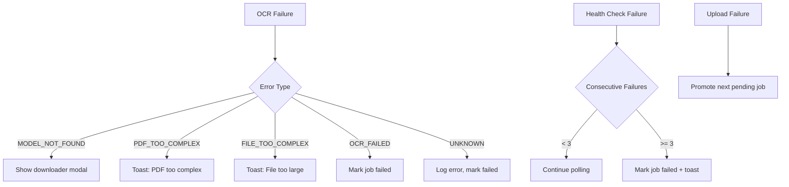
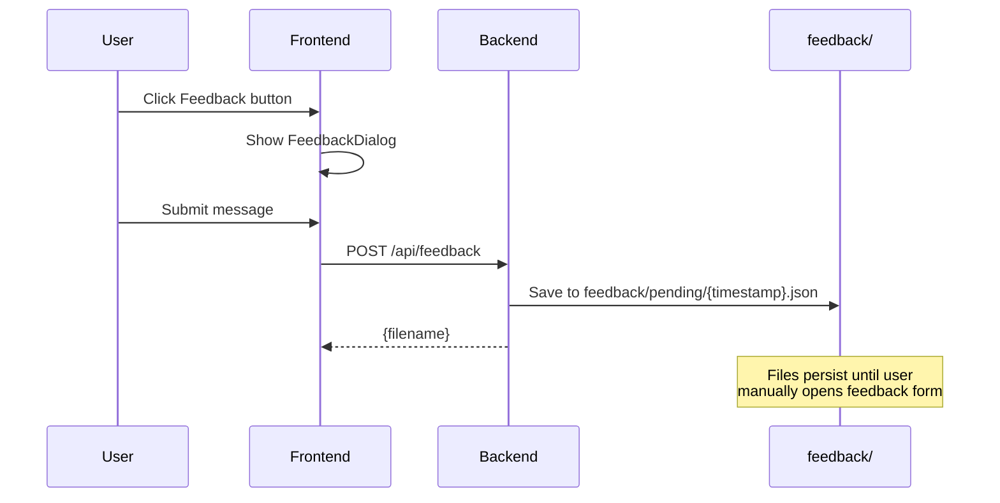

# Data Flows & Execution Pipelines

> **Generated:** 2026-09-03

---

## 1. OCR Execution Pipeline

### 1.1 Sequence Diagram



### 1.2 Key Components

| Component | Location | Responsibility |
|-----------|----------|----------------|
| `FileDropZone` | `frontend/src/components/dropzone/FileDropZone.tsx` | File validation, batch cap enforcement |
| `scan2text.store` | `frontend/src/stores/scan2text.store.ts` | Job state, polling logic |
| `api.ts` | `frontend/src/lib/api.ts` | HTTP client functions |
| `_run_processing()` | `src/scan2text/api/main.py:98-165` | Background task orchestration |
| `VlmOcrAdapter` | `src/scan2text/adapters/vlm_ocr.py` | OCR engine wrapper |
| `_vlm_worker()` | `src/scan2text/adapters/vlm_ocr.py:91-161` | Persistent Llama CPP worker |
| `OutputService` | `src/scan2text/services/output_service.py` | Markdown file writing |

---

## 2. Model Download Pipeline

### 2.1 Sequence Diagram



### 2.2 Key Files

| File | Purpose |
|------|---------|
| `src/scan2text/services/model_downloader_service.py` | Download orchestration |
| `frontend/src/components/layout/ModelDownloaderModal.tsx` | Progress UI |
| `frontend/src/lib/api.ts:getSettings()` | Hydrate enhance toggle |

---

## 3. Settings Lifecycle

### 3.1 Flow Diagram



### 3.2 Key Components

| Component | Location |
|-----------|----------|
| `SettingsService` | `src/scan2text/services/settings_service.py` |
| `AppSettings` model | `src/scan2text/models/settings.py` |
| `preferencesStore` | `frontend/src/stores/preferencesStore.ts` |
| `SettingsDialog` | `frontend/src/components/layout/SettingsDialog.tsx` |

---

## 4. Backend Lifecycle

### 4.1 Startup Sequence

```mermaid
sequenceDiagram
    participant Tauri as Tauri Shell (Rust)
    participant Backend as scan2text-backend.exe
    participant Health as /api/health

    Tauri->>Tauri: boot_backend()
    alt Debug mode
        Tauri->>Tauri: Skip spawn (dev.ps1 manages backend)
    else Production
        Tauri->>Tauri: resolve_backend_path()
        Tauri->>Backend: Spawn with log redirection
        Tauri->>Tauri: watch_for_early_exit() thread
        loop Health check (30s timeout)
            Tauri->>Health: GET /api/health
            alt 200 OK
                Tauri->>Tauri: Backend ready
                break
            else Timeout
                Tauri->>Tauri: Emit backend-boot-failed
                Tauri->>Tauri: Exit with error
            end
        end
    end
```

### 4.2 Shutdown Sequence



---

## 5. Job State Machine

### 5.1 Status Transitions



### 5.2 Queue Management

**FIFO Order:** `jobOrder[]` array maintains insertion order.

**Active Job Logic:**
```typescript
// scan2text.store.ts:269-291
startNextPendingJob() {
  const nextJobId = jobOrder.find(jid => !TERMINAL_STATUSES.includes(jobs[jid].status))
  if (nextJobId) startUpload({ file: jobs[nextJobId].file, jobId: nextJobId })
}
```

---

## 6. Error Handling Flow

### 6.1 Error Propagation



### 6.2 Error Codes

| Code | Meaning | UI Response |
|------|---------|-------------|
| `MODEL_NOT_FOUND` | Model files missing | Show downloader modal |
| `PDF_TOO_COMPLEX` | Exceeds page limit | Toast info |
| `FILE_TOO_COMPLEX` | Exceeds 20MB | Toast info |
| `OCR_FAILED` | Inference failed | Job failed, retry available |
| `BACKEND_LOST` | Health check failed 3x | Toast error, job failed |

---

## 7. Feedback Flow

### 7.1 Offline Queue



---

## 8. Path Resolution Flow

### 8.1 Home Directory Resolution

```mermaid
flowchart TD
    A[PathService.init] --> B{SCAN2TEXT_HOME env?}
    B -->|Yes| C[Use env value]
    B -->|No| D{Frozen exe?}
    D -->|Yes| E[exe_dir.parent.parent]
    D -->|No| F[Repo root\nparents[3]]
    
    C --> G[Set base_dir]
    E --> G
    F --> G
```

### 8.2 Output Path Generation

```mermaid
flowchart LR
    A[Source path] --> B[Sanitize stem]
    B --> C[Format timestamp]
    C --> D[{stem}_{HHmm}_{yyyyMMdd}.md]
    D --> E{Exists?}
    E -->|No| F[Return path]
    E -->|Yes| G[Append _2, _3, etc.]
    G --> E
```
