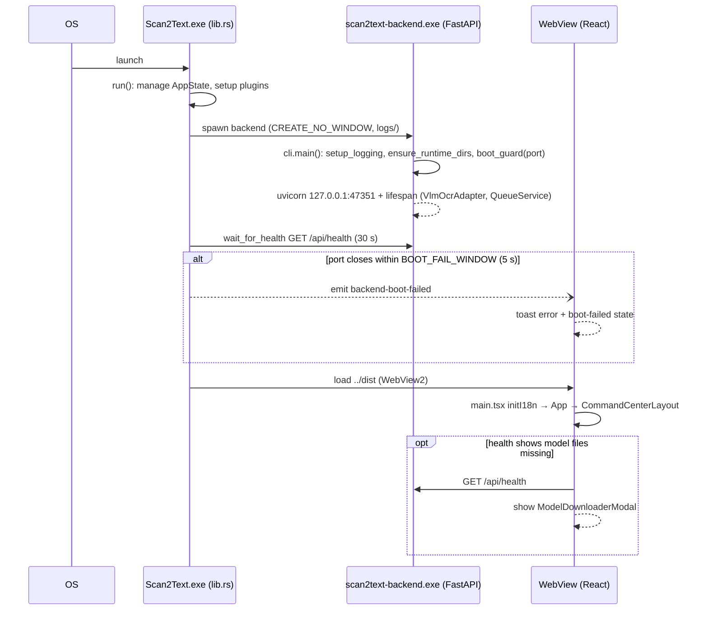
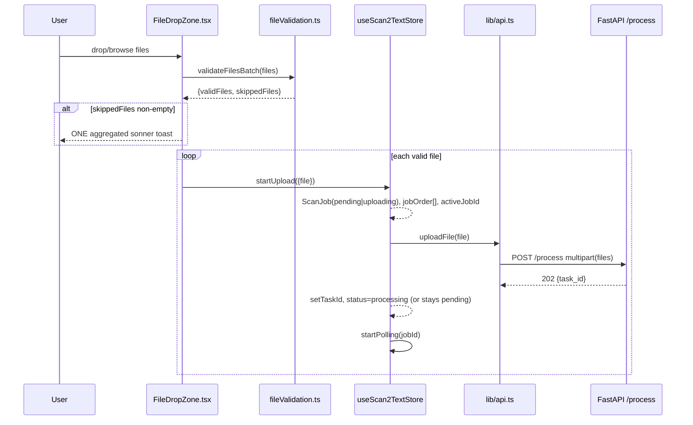
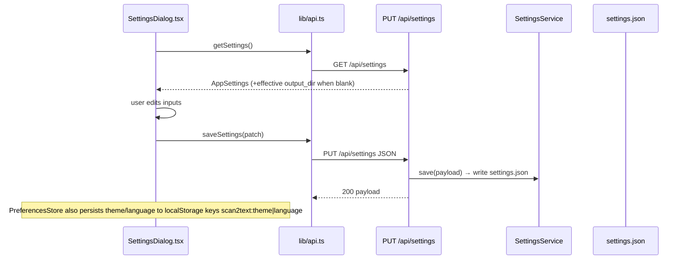
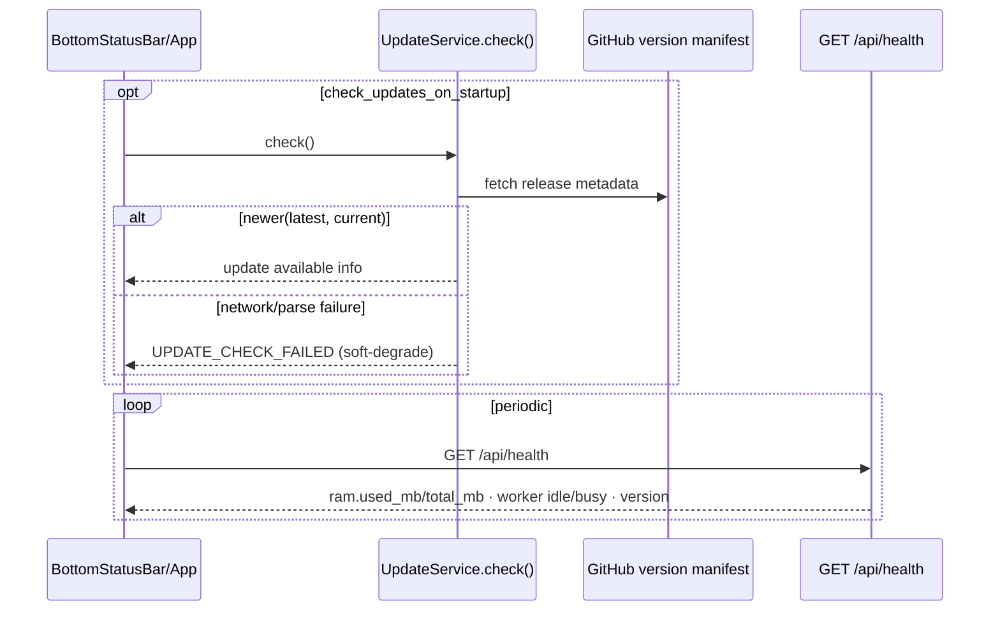

# 03 — Data Flows & Execution Pipelines

> Master reference: [`ARCHITECTURE.md`](./ARCHITECTURE.md) · Siblings: [01_FILE_MATRIX](./01_FILE_MATRIX.md) · [02_IPC_AND_API_CONTRACTS](./02_IPC_AND_API_CONTRACTS.md) · [04_ENVIRONMENT_AND_BUILD](./04_ENVIRONMENT_AND_BUILD.md)

All names/timings below are quoted from source (not spec): `frontend/src/**`, `src/scan2text/**`, `frontend/src-tauri/src/**`.

---

## Flow 1 — Application Boot

**Prose.**
1. `Scan2Text.exe` starts → `main.rs:main()` calls `app_lib::run()` (`lib.rs:363`).
2. `tauri::Builder.setup` manages `AppState(Arc<Mutex<BackendManager>>)`, installs `tauri_plugin_shell` (+ `tauri_plugin_log` in debug), then `boot_backend(&mut mgr)` (`lib.rs:377-389`).
3. Release builds only: `BackendManager.start(30s)` resolves `backend/scan2text-backend.exe` via `resolve_backend_path()`, spawns it windowless (`spawn_creation_flags`, stdout→log file in `logs/` via `derive_log_path`), arms the early-exit watcher, then `wait_for_health(30s)` probes raw-TCP `GET /api/health`. Dev builds skip spawning (`dev.ps1` runs uvicorn on :8000).
4. Backend side: frozen exe entry `cli.py:main()` → `setup_logging()` → `get_paths().ensure_runtime_dirs()` → `boot_guard(port)` (singleton lock) → `uvicorn.run(app, host="127.0.0.1", port=get_port())`; FastAPI `lifespan` builds `VlmOcrAdapter` + `QueueService`.
5. If the backend dies ≤5 s after spawn, watcher emits **`backend-boot-failed`**; frontend hook `useBackendBootFailedListener.ts` toasts and flips boot-failure state.
6. React tree mounts: `main.tsx` (`initI18n`, sonner `<Toaster>`) → `App.tsx` → `CommandCenterLayout` (TopBar / panels / BottomStatusBar); `WelcomeModal` shows each launch until dismissed (`hide_welcome_notice`). If `/api/health` reports models missing, `App.tsx` opens `ModelDownloaderModal` (`showDownloader`).



---

## Flow 2 — Drop, Validation & Enqueue

**Prose.**
1. `FileDropZone.tsx` (HTML5 drag-drop/click; native DnD disabled in tauri.conf) hands a `FileList` to `validateFilesBatch()` (`lib/fileValidation.ts`).
2. Rules in code: MIME or extension ∈ PNG/JPG/JPEG/WEBP/PDF; size ≤ `MAX_FILE_SIZE = 20 MB` (`fileValidation.ts:1`); batch handling returns `{ validFiles, skippedFiles[] }`.
3. Invalid files produce one aggregated sonner toast and never enter the queue; valid files call `scan2text.store.startUpload({file})`.
4. `startUpload` creates a `ScanJob` (status `uploading` if no active job else `pending`), appends to FIFO `jobOrder[]`, sets single `activeJobId`, then POSTs.
5. The Batch cap is enforced at queue level (`MAX_BATCH_FILES = 10` constant defined in store/constants — first 10 kept).



---

## Flow 3 — OCR Job Execution & Polling Lifecycle

**Frontend polling:** `pollJob` runs `pollTaskStatus(taskId, {maxAttempts:30, intervalMs:1000})` foreground; on terminal response updates the job; otherwise starts an unbounded background endurance loop (health probe then status poll every **60 s**, fail only after **3 consecutive** `getHealth()` failures, long-doc hint toast every 2 min). Error codes `PDF_TOO_COMPLEX`/`FILE_TOO_COMPLEX` toast info; `MODEL_NOT_FOUND` also opens downloader.

**Backend execution:** `_run_processing` (`api/main.py`) marks task `processing`, broadcasts WS frame, then off-loads `QueueService.process_image_paths(paths, adapter, path_to_stem)` to a thread. Per-file pipeline inside QueueService:
1. Intake/classify — `FileService.discover`, `pdf_service.detect_file_type` (magic-byte sniffing).
2. PDF path — `render_pdf_to_images` (pypdfium2), page-limit guard `check_page_limit(max_pdf_pages=50)`; chart crops extracted by `postprocess_service.extract_and_save_image_crops` into `output/images/`.
3. OCR — `VlmOcrAdapter.process_file`: worker subprocess with llama.cpp GGUF (`models/vlm.gguf` + mmproj), verbatim `_VLM_PROMPT` ("Extract all readable content … Markdown … tables as HTML …"), `temperature=0.1`, CPU threads from `calculate_auto_threads` (60% logical cores, ADR-007); hard timeout surfaces sentinel `"OCR_TIMEOUT"`.
4. Post-process — `convert_html_tables_to_gfm` (`_TableParser` HTMLParser→GFM rows, so react-markdown/GFM doesn't break), `filter_noise_lines` (drops bare ints/filler noise), full-page normalization (no tiling, S2-S4 recipe).
5. Output — `OutputService.write` → `PathService.resolve_output_path`: naming `{stem}_{HHmm}_{yyyyMMdd}.md`, collisions `_2`/`_3` (mirror of frontend util `generateOutputFilename` in `lib/naming.ts`); empty-text results quarantined instead of written (`has_no_text`, `_resolve_unique_quarantine_name`, mirrored by tests `test_no_text_guard.py` / `TestQueueServiceQuarantine`).
6. Result markdown read back and joined `\n---\n`; statuses computed (failed-only ⇒ `OCR_FAILED`, mixed ⇒ `PARTIAL_FAILURE`) and broadcast.

```mermaid
sequenceDiagram
    participant ST as useScan2TextStore
    participant API as lib/api.ts pollTaskStatus
    participant RT as GET /status/:id
    participant MP as _run_processing
    participant QS as QueueService.process_image_paths
    participant AD as VlmOcrAdapter (llama.cpp)
    participant PP as postprocess_service
    participant OUT as OutputService/PathService

    ST->>API: pollTaskStatus(taskId, 30×1000ms)
    API->>RT: GET /status/{task_id} (1/s ×30)
    MP->>QS: asyncio.to_thread(process_image_paths)
    QS->>QS: detect_file_type, render_pdf_to_images (if PDF)
    QS->>AD: process file image (prompt, temp 0.1)
    AD-->>QS: markdown text | OCR_TIMEOUT
    QS->>PP: convert_html_tables_to_gfm, filter_noise_lines
    PP-->>QS: clean GFM markdown
    QS->>OUT: write {stem}_{HHmm}_{yyyyMMdd}.md (_2/_3 collision)
    QS-->>MP: BatchSummary{total_inputs,succeeded,failed,job_results}
    MP->>MP: status completed|failed(+error_code)
    MP--)RT: broadcast WS progress frame
    RT-->>ST: {status, result_markdown?}
    alt still processing after 30 s
        loop every 60 s until terminal
            ST->>API: getHealth() then getTaskStatus()
            Note over ST: 3 consecutive health fails ⇒ job failed(errors.backendLost)
        end
    else failed w/ MODEL_NOT_FOUND
        ST-->>ST: setShowDownloader(true)
    end
    ST-->>ST: resultMarkdown set, selectedJobId=id, promoteNextPending()
    ST->>UI participant as PreviewPanel renders markdown
    ST->>BE: invoke('open_output_folder') via PreviewPanel button
```

*(Mermaid note: “ST→UI participant” denotes render of MarkdownPreview inside PreviewPanel — same webview process as ST.)*

**Retry semantics:** QueuePanel retry on failed row calls `retryJob(id)` — removes ghost, mints new UUID job id, re-runs `startUpload({file, jobId:newId})`.

---

## Flow 4 — Settings Change

SettingsDialog loads effective settings, edits fields (output dir, max pdf pages, cpu threads…), saves once. Server persists `settings.json`; non-empty validation applies. Preferences theme/language additionally live in localStorage (`preferencesStore` → `saveSettings` PUT) and toggle `.dark` class + i18next language instantly.



---

## Flow 5 — Model Download

ModelDownloaderModal polls `/api/download/status` on open; Start posts `/api/download/start` (threaded download of `vlm.zip`+`mmproj.zip` per root `version.json`, sha256+size verified, zip-extracted into resolved `models_dir` — priority order exercised by `test_models_dir_priority.py`); Cancel posts `/api/download/cancel`.

```mermaid
sequenceDiagram
    participant MD as ModelDownloaderModal
    participant DS as ModelDownloaderService
    participant GH as GitHub Releases
    participant M as models/

    MD->>+DS: POST /api/download/start
    loop background thread per artifact
        DS->>GH: urlopen(version.json URL)
        DS->>DS: stream chunks, update bytes_downloaded
        DS->>DS: verify sha256 + size, zipfile extract
        DS->>M: vlm.gguf / mmproj.gguf
    end
    loop modal open (polling)
        MD->>DS: GET /api/download/status (no-store)
        DS-->>MD: {status, bytes_downloaded, total_bytes, error_message}
    end
    opt cancel
        MD->>DS: POST /api/download/cancel
    end
    MD-->>MD: close modal; next /api/health shows model.loaded=true
```

---

## Flow 6 — Feedback (offline queue, ADR-007)

FeedbackDialog submits text (+optional contact). No network send occurs from the app beyond writing local files; sending is manual by design (no silent send).

```mermaid
sequenceDiagram
    participant FB as FeedbackDialog.tsx
    participant R as POST /api/feedback
    participant FV as FeedbackService
    participant Q as feedback/pending|sent

    FB->>R: submit {message, contact?}
    R->>FV: save_pending_feedback(...)
    FV->>Q: write .txt under feedback/pending/
    R-->>FB: {filename}
    FB-->>FB: sonner confirm; GForm link opened manually via plugin-shell
    Note over Q: mark-sent moves file pending→sent (POST /api/feedback/mark-sent)
```

---

## Flow 7 — Version / Update Check

`UpdateService.check(url?, current_version="0.1.0")` fetches remote manifest (opt-in via settings `check_updates_on_startup`), compares semver `_newer(latest,current)`; failure degrades to error code `UPDATE_CHECK_FAILED`. BottomStatusBar displays version string and RAM gauge sourced from periodic `GET /api/health`; Share button is a locked placeholder (`https://placeholder.local`, soft toast only).


