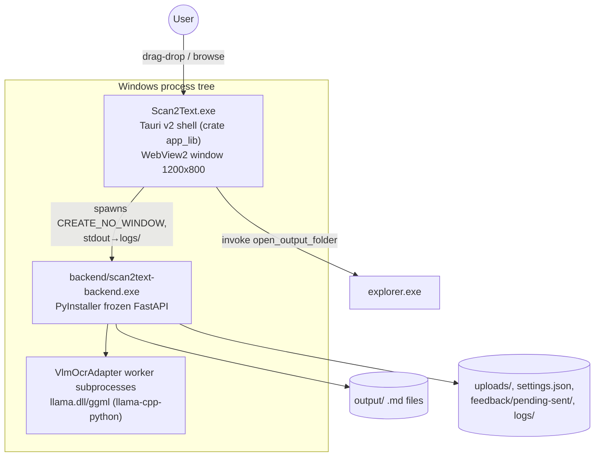

# ARCHITECTURE — Scan2Text Master Reference

*Generated 2026-08 by static analysis of the working tree. Everything below quotes real identifiers from source; sibling documents carry the exhaustive ledgers:*
[`01_FILE_MATRIX.md`](./01_FILE_MATRIX.md) · [`02_IPC_AND_API_CONTRACTS.md`](./02_IPC_AND_API_CONTRACTS.md) · [`03_DATA_FLOWS.md`](./03_DATA_FLOWS.md) · [`04_ENVIRONMENT_AND_BUILD.md`](./04_ENVIRONMENT_AND_BUILD.md)

---

## 1. System Purpose & Design Principles

Scan2Text is a **portable, offline, CPU-only Windows desktop app** that converts images (PNG/JPG/JPEG/WEBP) and PDFs into clean GFM Markdown using a local multimodal LLM (**OvisOCR2 0.9B** GGUF via llama.cpp). It is *not* a document editor.

Locked principles (CEO decisions, `AGENTS.md` §8 / ADR-007):
- **Local-first, offline**: every inference, settings write, and feedback item stays on disk; the only network activity is opt-in model download (`version.json` → GitHub Releases) and opt-in update check.
- **Markdown-output-first**: files land in `output\` as `{stem}_{HHmm}_{yyyyMMdd}.md` (collisions `_2`/`_3`, never overwrite).
- **Memory-only job state**: nothing about a job survives a restart; only theme + language persist via localStorage.
- **Privacy**: logs rotate at 1 MB with a `PrivacyFilter` that strips filenames/content; feedback is an explicit manual queue ("no silent send").
- **YAGNI engine policy** (ADR-006): Ovis is the sole engine; swapping = replacing the whole recipe (prompt + sampling + geometry together).

## 2. Runtime Topology & Process Model



- Ports: prod `127.0.0.1:47351` (Rust const `BACKEND_PORT`, `prod_runtime.get_port()`, TS `apiBase.ts`); dev uvicorn on :8000 with Vite dev server :5173.
- Startup contract: Tauri `setup()` → `boot_backend()` → spawn → raw-TCP `GET /api/health` readiness (30 s budget) → failure within 5 s emits `backend-boot-failed` to the UI.
- Shutdown contract: `RunEvent::CloseRequested/ExitRequested/Exit` → `BackendManager.stop()` → image-name `taskkill /IM scan2text-backend.exe /T` → verify port closed ≤30 s.

## 3. Layer-by-Layer Breakdown

### 3.1 Tauri shell (`frontend/src-tauri/`)
- `main.rs` → `app_lib::run()` (`lib.rs`).
- `lib.rs`: builder + plugins (log in debug, shell), `AppState(Arc<Mutex<BackendManager>>)`, health/port helpers, teardown chain, single IPC command **`open_output_folder(path)`**, validate→create→explorer.
- `backend_process.rs`: idempotent spawn/stop lifecycle, `resolve_backend_path()` discovery walk, early-exit watcher → event emission, log-file plumbing, Windows creation flags.
- Full detail: [02 §4](./02_IPC_AND_API_CONTRACTS.md#4-tauri-ipc-bridge-rust--webview).

### 3.2 FastAPI backend (`src/scan2text/`)
- **api/**: `main.py` (app object, CORS allow-all on localhost bind, lifespan wiring of adapter+queue, live endpoints `POST /process`, `GET /status/{task_id}`, `WS /ws/progress`, in-memory `_task_store`); `websocket_manager.py` `ConnectionManager`.
- **routes/**: `health.py` (`GET /api/health` telemetry incl. worker busy/idle, RAM/CPU, model loaded/files_present, version), `settings.py` (GET/PUT `/api/settings`), `download.py` (`/api/download/{start,status,progress,cancel}`), `feedback.py` (`POST /api/feedback`, `GET /api/feedback/pending-count`, `POST /api/feedback/mark-sent`); `jobs.py` is a legacy **unmounted** router.
- **services/**: `path_service.PathService` (portable-root resolution + `get_paths()`), `queue_service.QueueService` (batch orchestration, `BatchSummary`, quarantine), `file_service.FileService` (discovery/validation models), `pdf_service` (`detect_file_type`, `render_pdf_to_images`, page/size guards), `adapters/vlm_ocr.VlmOcrAdapter` (+ protocol `ocr_engine.OCREngine`/`FakeOCR`), `postprocess_service` (`convert_html_tables_to_gfm`, `filter_noise_lines`, `extract_and_save_image_crops`), `output_service.OutputService` (+ legacy `save_markdown`), `settings_service.SettingsService` ↔ `settings.json`, `model_downloader_service.ModelDownloaderService` (threaded download, sha256+size verify, zip extract), `feedback_service.FeedbackService` (pending/sent dirs), `update_service.UpdateService` (version compare), `logging_service` (`PrivacyFilter`, `StructuredFormatter`, 1 MB rotation).
- **utils/**: `cpu_budget.calculate_auto_threads` (auto = 60% logical cores), `prod_runtime` (frozen detection, host/port).
- Module-level ledger with import edges: [01_FILE_MATRIX §2.1](./01_FILE_MATRIX.md#21-python-backend-srcscan2text).

### 3.3 React frontend (`frontend/src/`)
- **Shell** (`components/layout/`): `CommandCenterLayout.tsx` implements Command Center v1.7 — fixed inset-0 kiosk, TopBar (34 px) / main grid 34fr/60fr / always-visible BottomStatusBar (worker state · RAM · version · Share placeholder · FeedbackButton). Panels under `panels/`: DropZonePanel (38% / 62% split left column), QueuePanel (dot-only 14px status slot, retry-on-failed, FIFO internal scroll), PreviewPanel + `MarkdownPreview` (react-markdown + remark-gfm, prose typography, Copy Markdown / Open Folder).
- **Intake**: `FileDropZone.tsx` → `lib/fileValidation.ts` (`MAX_FILE_SIZE=20 MB` code-truth; MIME-or-extension allowlist PNG/JPG/JPEG/WEBP/PDF) → one aggregated sonner toast per invalid batch.
- **State** (`stores/`): `scan2text.store.ts` (memory-only Zustand: `jobs` map, FIFO `jobOrder[]`, single-active via `activeJobId`, upload/poll/endurance-loop/retry orchestration — full contract in [02 §5](./02_IPC_AND_API_CONTRACTS.md#5-frontend-client-function-matrix)); `preferencesStore.ts` (localStorage `scan2text:theme` / `scan2text:language`, synced to backend settings); `fileStore.ts`.
- **Supporting**: `i18n/index.ts` i18next EN+ID parity, `hooks/useBackendBootFailedListener.ts` (Tauri event), `lib/api.ts` typed fetch client, `sonner` toasts, Coffee & Paper dark/light palette tokens locked by `theme/palette-lock.test.ts`.

## 4. Consolidated Data Flow

Single-frame summary (per-phase sequence diagrams: [03_DATA_FLOWS.md](./03_DATA_FLOWS.md)):

```mermaid
sequenceDiagram
    participant User
    participant React as React UI (stores + panels)
    participant Shell as Tauri shell
    participant API as FastAPI backend
    participant OCR as VlmOcrAdapter+QueueService
    participant Disk as output/ + models/

    Note over Shell,API: boot — spawn, health probe, boot-failed event
    User->>React: drop valid files
    React->>API: POST /process (multipart)
    API-->>React: {task_id}
    loop poll 30×1000ms then endurance 60s loop
        React->>API: GET /status/{task_id} (health-guarded)
    end
    API->>OCR: process_image_paths (PDF render → prompt temp0.1 → GFM postprocess)
    OCR->>Disk: write dated .md (quarantine if empty text)
    API--)React: WS progress frames (/ws/progress)
    React->>User: PreviewPanel markdown; invoke('open_output_folder')
```

## 5. State Management Contract

| Store | Scope | Persisted? | Key fields/actions |
|---|---|---|---|
| `useScan2TextStore` | app session | **No** — jobs never persist | `jobs: Record<string, ScanJob>`, `jobOrder[]` FIFO, `activeJobId` (single active), `selectedJobId`, `showDownloader`; actions `addJob/startUpload/setStatus/pollJob/startNextPendingJob/promoteNextPending/retryJob/removeJob` |
| `usePreferenceStore` | across launches | localStorage only (theme, language) | theme dark default, language en/id/auto-detect |
| Backend `_task_store` | backend lifetime | No | task status/progress/result_markdown per UUID |

Frontend status machine: `pending → uploading → processing → completed|failed` with terminal-state guard (`TERMINAL_STATUSES`, `isValidTransition`) and health-failure counter escalation (≥3 consecutive `/api/health` failures ⇒ `errors.backendLost`).

## 6. Security & Privacy Posture

- Backend binds `127.0.0.1` only (`prod_runtime.get_host`); CORS wildcard acceptable because the listener is localhost-exclusive.
- No telemetry; no content/filename logging (`logging_service.PrivacyFilter`).
- Share button = hard placeholder `https://placeholder.local` with soft toast (no navigation, CEO lock).
- Feedback never auto-transmits; pending queue + manual send.
- Model downloads are integrity-checked (`sha256` + size from `version.json`) before extraction into `models/`.
- Process cleanup uses aggressive image-name taskkill to prevent zombie PyInstaller daemons.

## 7. Key Architectural Decisions (ADR index, `second-brain/03-Architecture/ADRs/`)

| ADR | Decision |
|---|---|
| ADR-003 | Platform-agnostic file upload contract |
| ADR-005 | Consolidated Python backend (`src/scan2text` single package) |
| ADR-006 | OvisOCR2 engine swap — recipe travels together (verbatim `_VLM_PROMPT`, `temperature=0.1`, full-page normalization, HTML tables then GFM conversion) |
| ADR-007 | Feedback offline queue · CPU auto = 60% cores · welcome screen each launch · GitHub Releases distribution · monthly cadence · 1 MB privacy-rotating logs |
| ADR-008 | Tauri desktop shell + side-car PyInstaller packaging; fixed port 47351 |

## 8. Extension Points & Known Constraints

- Sole-engine YAGNI: adding an engine means implementing the `OCREngine` protocol (`adapters/ocr_engine.py`) and dropping a new recipe — nothing else should change.
- Settings exposes engine knobs (`model_path/mmproj_path/n_ctx/n_threads/ocr_timeout_seconds/worker_priority`) as JSON-only advanced config (ADR-005 era) — no UI.
- Legacy unmounted `/api/jobs*` router kept for reference; do not extend it.
- Constraints: Tailwind **v3** lock; Python **3.12** lock; JSRAM-in-memory jobs imply re-drop after restart; Windows-only explorer integration (`open_output_folder` errors off-Windows).

## 9. Sibling Document Index

| Doc | Contents |
|---|---|
| [01_FILE_MATRIX.md](./01_FILE_MATRIX.md) | ASCII tree; per-file Import/Dependent ledger (Python/Rust/TS/configs/scripts/tests) |
| [02_IPC_AND_API_CONTRACTS.md](./02_IPC_AND_API_CONTRACTS.md) | Live HTTP endpoint schemas, WebSocket frames, Tauri commands/events, client↔endpoint matrix, error codes |
| [03_DATA_FLOWS.md](./03_DATA_FLOWS.md) | 7 end-to-end lifecycles with Mermaid sequence diagrams (boot, intake, OCR pipeline, settings, downloads, feedback, updates) |
| [04_ENVIRONMENT_AND_BUILD.md](./04_ENVIRONMENT_AND_BUILD.md) | Toolchains, pinned manifests, env vars, dev/test commands, PyInstaller+Tauri packaging, portable layout rules |
