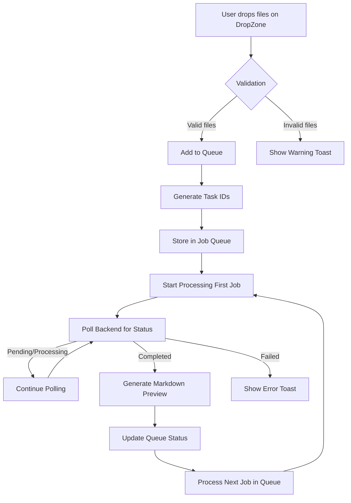

# Data Flows

## Overview
This document illustrates the flow of data through the Scan2Text application, covering user interactions, processing pipelines, and state management.

## Primary User Flows

### 1. File Import and Processing Flow


### 2. OCR Processing Flow (Backend)
```mermaid
flowchart TD
    A[Receive POST /process] --> B[Validate Files]
    B -->|Valid| C[Create Job Record]
    C --> D[Return task_id]
    D --> E[Add to Processing Queue]
    E --> F[Worker Picks Job]
    F --> G[Load OCR Model (Ovis)]
    G --> H[Process Image/PDF]
    H --> I[Generate Raw Text Output]
    I --> J[Convert to GitHub Flavored Markdown]
    J --> K[Save Markdown File]
    K --> L[Update Job Status to Completed]
    L --> M[Notify via GET /status/{task_id}]
    B -->|Invalid| N[Return Validation Error]
```

### 3. User Interface Update Flow
```mermaid
flowchart TD
    A[Backend Status Update] --> B[Zustand Store Update]
    B --> C[React Re-render Affected Components]
    C --> D[Update Queue Panel Row]
    D --> E[Update Status Dot (grey/spinner/green/red)]
    C --> F[Update Preview Panel if Active Job]
    F --> G[Render New Markdown Content]
    G --> H[Apply Syntax Highlighting]
```

## State Management Flow

### Zustand Store Structure
```mermaid
flowchart LR
    A[scan2text.store.ts] --> B[jobOrder: Job[]]
    A --> C[activeJobId: string | null]
    A --> D[jobResults: Map<string, JobResult>]
    A --> E[isProcessing: boolean]
    A --> F[pollingInterval: NodeJS.Timeout | null]
    
    B --> G[FIFO Queue Processing]
    C --> H[Single Active Job Constraint]
    D --> I[Results Keyed by Task ID]
    E --> J[Prevent Concurrent Processing]
    F --> K[Controlled Polling Mechanism]
```

### Store Update Triggers
1. **User Action**: File drop → Add jobs to queue
2. **Backend Response**: Status poll → Update job status
3. **Internal Timer**: Polling interval → Trigger status check
4. **Completion Event**: Job finished → Start next job

## Data Transformation Pipeline

### Input Processing
```
[User File] 
    → [MIME Type Validation] 
    → [Size Check (<50MB)] 
    → [Extension Whitelist Check] 
    → [Sanitized Filename] 
    → [Temporary Storage (if needed)]
```

### OCR Processing (Backend)
```
[Raw Image/PDF]
    → [Pre-processing (resize, normalize)]
    → [Ovis Model Inference]
    → [Character Sequence Generation]
    → [Layout Analysis (optional)]
    → [Text Block Formation]
    → [Markdown Formatting]
    → [GFM Standard Compliance]
    → [Final Markdown Output]
```

### Output Generation
```
[OCR Raw Text]
    → [Line Break Normalization]
    → [Block Element Detection (headers, lists)]
    → [Inline Formatting (bold, italic, code)]
    → [Table Structure Preservation]
    → [Link Detection (if applicable)]
    → [Final GFM-Compliant Markdown]
```

## Cross-Component Data Flow

### DropZone → Queue Panel
1. User drops files on DropZone
2. DropZone validates files (client-side)
3. Valid files sent to store via `addJobs()` action
4. Store updates `jobOrder` state
5. QueuePanel subscribes to store changes
6. QueuePanel renders new job rows

### Queue Panel → Preview Panel
1. User clicks queue item or auto-advance occurs
2. Store sets `activeJobId` via `setActiveJob()` action
3. PreviewPanel subscribes to store changes
4. PreviewPanel fetches result from `jobResults` map
5. PreviewPanel renders markdown via MarkdownPreview component

### Preview Panel → User Actions
1. User clicks "Copy Markdown" button
2. MarkdownPreview copies text to clipboard
3. User clicks "Open Folder" button
4. Application opens file explorer to output directory

## Error Handling Flow

### Validation Errors
```
[Invalid File] 
    → [DropZone catches error] 
    → [Store adds error to job record] 
    → [QueuePanel displays error status] 
    → [User sees red status dot + tooltip]
```

### Processing Errors
```
[Backend Error] 
    → [Status poll returns failed state] 
    → [Store updates job to failed] 
    → [QueuePanel shows red status dot] 
    → [PreviewPanel displays error message if active]
    → [User can retry via queue item]
```

### Network Errors
```
[Polling Failure] 
    → [Retry with exponential backoff] 
    → [After max retries: show connection error] 
    → [Store marks job as failed] 
    → [UI reflects error state]
```

## Performance Considerations

### Memory Management
- Jobs stored only in memory (no persistence)
- Results cleared when new job starts (unless pinned)
- Maximum 10 jobs in queue prevents memory exhaustion
- OCR model loaded/unloaded per worker (future optimization)

### Processing Efficiency
- Single active job prevents resource contention
- Polling interval balances responsiveness with CPU usage
- Batch processing limits prevent UI freezing
- File validation occurs before queue entry

## Data Persistence Boundaries

### In-Memory Only (Current)
- Job queue and state: Lifetime = application session
- Processing results: Lifetime = until next job or app restart
- User preferences: Stored in localStorage (theme, language only)

### Future Persistence (Post-Phase 6)
- Optional job history (user-configurable)
- Output file indexing (search capability)
- User correction persistence (for model feedback)
