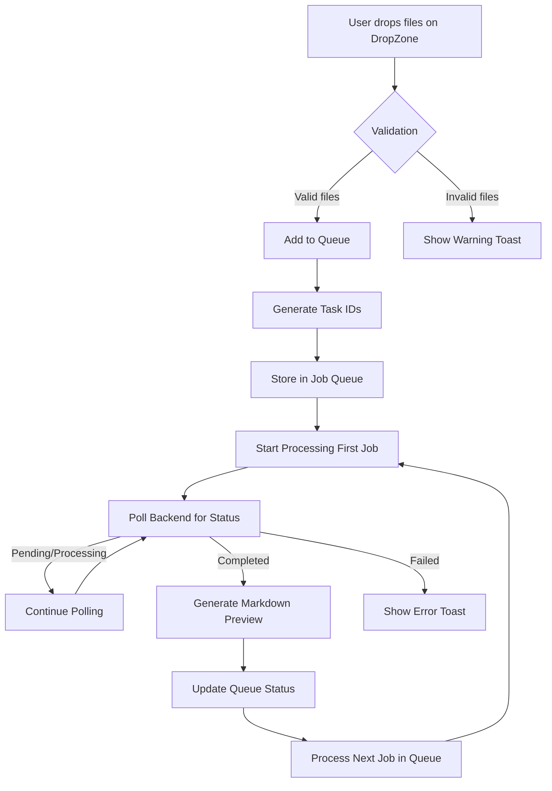

# Scan2Text Architecture Reference

This document serves as a unified master reference for the Scan2Text architecture, combining all architectural documentation into a single comprehensive guide.

## Table of Contents
1. [File Matrix](#1-file-matrix)
2. [IPC and API Contracts](#2-ipc-and-api-contracts)
3. [Data Flows](#3-data-flows)
4. [Environment and Build](#4-environment-and-build)

---

## 1. File Matrix

# File Matrix

## Overview
This document maps the key files and modules in the Scan2Text codebase, organized by functionality and layer.

## Frontend Structure (`frontend/`)

### Core Application
- src/main.tsx - Entry point
- src/App.tsx - Root application component
- src/index.css - Global styles and Tailwind imports

### Layout Components
- src/components/layout/CommandCenterLayout.tsx - Main shell layout (TopBar, Main, BottomBar)
- src/components/layout/TopBar.tsx - Application header with logo and controls
- src/components/layout/BottomStatusBar.tsx - Status display with worker info and version
- src/components/layout/SettingsDialog.tsx - User preferences dialog

### Panel Components
- src/components/layout/panels/DropZonePanel.tsx - File drop zone interface
- src/components/layout/panels/QueuePanel.tsx - Job queue management
- src/components/layout/panels/PreviewPanel.tsx - Markdown preview display
- src/components/layout/panels/MarkdownPreview.tsx - Markdown rendering component

### UI Components
- src/components/dropzone/FileDropZone.tsx - Drag-and-drop file handling
- src/components/ui/ - shadcn/ui primitives (button, card, dialog, etc.)

### State Management
- src/stores/scan2text.store.ts - Zustand store for application state
- src/stores/scan2text.store.test.ts - Unit tests for the store

### Utilities
- src/lib/naming.ts - Output filename generation utilities
- src/lib/api.ts - Backend API communication layer
- src/lib/i18n.ts - Internationalization setup

### Localization
- src/locales/en.json - English translations
- src/locales/id.json - Indonesian translations

### Assets
- src/Images/ - Logo, brand image, and background assets

## Backend Structure (`backend/` - Phase 7)
*Note: Backend implementation occurs in Phase 7*

### Core Services
- src/main.py - FastAPI application entry point
- src/api/v1/endpoints/process.py - OCR processing endpoints
- src/core/ocr_engine.py - Ovis OCR engine wrapper
- src/core/task_manager.py - Job queue and status tracking
- src/utils/naming.py - Filename generation (mirrors frontend util)

### Configuration
- src/config/settings.py - Application configuration
- src/config/logging.py - Logging setup

### Models
- src/models/job.py - Job status and metadata models
- src/models/response.py - API response models

### Tests
- tests/ - Unit and integration tests (Phase 7)

## Shared Concepts

### Data Models
- Job: Represents an OCR processing task with states (pending, processing, completed, failed)
- File: Input file metadata (name, size, type, path)
- Output: Generated Markdown file metadata

### Communication Protocols
- REST API: JSON over HTTP for frontend-backend communication
- IPC: Tauri-specific communication for desktop integration (when applicable)

### Build Artifacts
- frontend/dist/ - Vite-built production assets
- backend/ - Python package (when packaged)
- release/ - Executable builds (via Tauri in later phases)

## Dependencies

### Frontend
- React 18+ with TypeScript
- Zustand for state management
- Tailwind CSS v3 for styling
- shadcn/ui for UI components
- react-markdown for Markdown rendering
- react-i18next for internationalization
- Vitest for testing

### Backend (Phase 7)
- Python 3.12
- FastAPI for web framework
- Pydantic for data validation
- llama-cpp-python for Ovis model integration
- pytest for testing

## File Naming Conventions
- Components: PascalCase (e.g., FileDropZone.tsx)
- Hooks: camelCase with "use" prefix (e.g., useJobQueue.ts)
- Utilities: camelCase (e.g., naming.ts)
- Styles: kebab-case in CSS/Tailwind classes
- Tests: .test.ts suffix
- Backend: snake_case for Python files and functions

---

## 2. IPC and API Contracts

# IPC and API Contracts

## Overview
This document defines the communication contracts between frontend and backend, including API endpoints, data structures, and IPC mechanisms.

## Backend API (Phase 7)
*Note: API implementation occurs in Phase 7*

### Base URL
`http://127.0.0.1:8000` (localhost-only for security)

### Endpoints

#### Health Check
- **GET** `/health`
- **Description**: Returns service health status
- **Response**:
  {
    "status": "healthy",
    "version": "1.0.0",
    "timestamp": "2026-08-18T20:38:20Z"
  }

#### OCR Processing
- **POST** `/process`
- **Description**: Initiates OCR processing for uploaded files
- **Request**: multipart/form-data with file(s)
- **Response**:
  {
    "task_id": "string (uuid)",
    "status": "pending",
    "message": "Processing started"
  }

#### Job Status
- **GET** `/status/{task_id}`
- **Description**: Retrieves status of a processing job
- **Parameters**: 
  - `task_id` (path): UUID of the job
- **Response**:
  {
    "task_id": "string",
    "status": "pending|processing|completed|failed",
    "progress": 0-100,
    "result": {
      "markdown": "string (when completed)",
      "output_file": "string (filename when completed)"
    } | null,
    "error": "string (when failed)" | null
  }

### Polling Strategy
Frontend implements polling with exponential backoff:
1. Initial poll: 15 attempts every 2000ms (30 seconds total)
2. Background repoll: 10 attempts every 60000s (10 minutes total)
3. After timeout: Job considered failed

## Data Models

### Job Status Enum
- `pending`: Job queued but not started
- `processing`: OCR engine actively working
- `completed`: Processing finished successfully
- `failed`: Processing encountered an error

### File Validation
- **Allowed Types**: PNG, JPG, JPEG, WEBP, PDF
- **Maximum Size**: 50MB per file
- **Batch Limit**: 10 files per batch (extras skipped with warning)

### Output File Naming
Format: {stem}_{HHmm}_{yyyyMMdd}.md
- Collision handling: _2, _3, etc. suffixes
- Never overwrites existing files
- Generated by pure utility function: generateOutputFilename()

## Frontend-Backend Communication

### Request Headers
- Content-Type: multipart/form-data for file uploads
- Accept: application/json for all API responses

### Error Handling
- HTTP 400: Validation errors (invalid file type/size)
- HTTP 413: Payload too large (>50MB per file)
- HTTP 429: Rate limiting (if implemented)
- HTTP 500: Internal server error
- HTTP 503: Service unavailable

### Response Format
All API responses follow this structure:
{
  "success": boolean,
  "data": object | null,
  "error": string | null
}

## IPC Mechanisms (Tauri - Future Phases)

### Current State (Phase 1-6)
- Frontend-only application
- No backend IPC required
- All state managed in-memory via Zustand

### Planned IPC (Phase 7+)
When backend is implemented:
- Frontend communicates with backend via REST API only
- No direct Tauri IPC needed for core functionality
- Potential IPC for:
  - Native file system access (beyond drag-and-drop)
  - System notifications
  - Hardware acceleration detection

## Security Considerations

### Backend Security
- Bind to localhost only (127.0.0.1)
- No external network exposure
- File upload validation (type, size, content)
- Rate limiting to prevent abuse
- No persistent storage of uploaded files or results

### Data Privacy
- Local-first, offline-by-design
- No telemetry or data collection
- Files processed in memory only
- Results saved only to user-specified locations

## Versioning
- API version embedded in URL path: /api/v1/
- Backward compatibility maintained within major versions
- Version information available via /health endpoint

---

## 3. Data Flows

# Data Flows

## Overview
This document illustrates the flow of data through the Scan2Text application, covering user interactions, processing pipelines, and state management.

## Primary User Flows

### 1. File Import and Processing Flow


### 2. OCR Processing Flow (Backend)
```mermaid
flowchart TD
    A[Receive POST /process] --> B[Validate Files]
    B -->|Valid| C[Create Job Record]
    C --> D[Return task_id]
    D --> E[Add to Processing Queue]
    E --> F[Worker Picks Job]
    F --> G[Load OCR Model (Ovis)]
    G --> H[Process Image/PDF]
    H --> I[Generate Raw Text Output]
    I --> J[Convert to GitHub Flavored Markdown]
    J --> K[Save Markdown File]
    K --> L[Update Job Status to Completed]
    L --> M[Notify via GET /status/{task_id}]
    B -->|Invalid| N[Return Validation Error]
```

### 3. User Interface Update Flow
```mermaid
flowchart TD
    A[Backend Status Update] --> B[Zustand Store Update]
    B --> C[React Re-render Affected Components]
    C --> D[Update Queue Panel Row]
    D --> E[Update Status Dot (grey/spinner/green/red)]
    C --> F[Update Preview Panel if Active Job]
    F --> G[Render New Markdown Content]
    G --> H[Apply Syntax Highlighting]
```

## State Management Flow

### Zustand Store Structure
```mermaid
flowchart LR
    A[scan2text.store.ts] --> B[jobOrder: Job[]]
    A --> C[activeJobId: string | null]
    A --> D[jobResults: Map<string, JobResult>]
    A --> E[isProcessing: boolean]
    A --> F[pollingInterval: NodeJS.Timeout | null]
    
    B --> G[FIFO Queue Processing]
    C --> H[Single Active Job Constraint]
    D --> I[Results Keyed by Task ID]
    E --> J[Prevent Concurrent Processing]
    F --> K[Controlled Polling Mechanism]
```

### Store Update Triggers
1. **User Action**: File drop → Add jobs to queue
2. **Backend Response**: Status poll → Update job status
3. **Internal Timer**: Polling interval → Trigger status check
4. **Completion Event**: Job finished → Start next job

## Data Transformation Pipeline

### Input Processing
```
[User File] 
    → [MIME Type Validation] 
    → [Size Check (<50MB)] 
    → [Extension Whitelist Check] 
    → [Sanitized Filename] 
    → [Temporary Storage (if needed)]
```

### OCR Processing (Backend)
```
[Raw Image/PDF]
    → [Pre-processing (resize, normalize)]
    → [Ovis Model Inference]
    → [Character Sequence Generation]
    → [Layout Analysis (optional)]
    → [Text Block Formation]
    → [Markdown Formatting]
    → [GFM Standard Compliance]
    → [Final Markdown Output]
```

### Output Generation
```
[OCR Raw Text]
    → [Line Break Normalization]
    → [Block Element Detection (headers, lists)]
    → [Inline Formatting (bold, italic, code)]
    → [Table Structure Preservation]
    → [Link Detection (if applicable)]
    → [Final GFM-Compliant Markdown]
```

## Cross-Component Data Flow

### DropZone → Queue Panel
1. User drops files on DropZone
2. DropZone validates files (client-side)
3. Valid files sent to store via `addJobs()` action
4. Store updates `jobOrder` state
5. QueuePanel subscribes to store changes
6. QueuePanel renders new job rows

### Queue Panel → Preview Panel
1. User clicks queue item or auto-advance occurs
2. Store sets `activeJobId` via `setActiveJob()` action
3. PreviewPanel subscribes to store changes
4. PreviewPanel fetches result from `jobResults` map
5. PreviewPanel renders markdown via MarkdownPreview component

### Preview Panel → User Actions
1. User clicks "Copy Markdown" button
2. MarkdownPreview copies text to clipboard
3. User clicks "Open Folder" button
4. Application opens file explorer to output directory

## Error Handling Flow

### Validation Errors
```
[Invalid File] 
    → [DropZone catches error] 
    → [Store adds error to job record] 
    → [QueuePanel displays error status] 
    → [User sees red status dot + tooltip]
```

### Processing Errors
```
[Backend Error] 
    → [Status poll returns failed state] 
    → [Store updates job to failed] 
    → [QueuePanel shows red status dot] 
    → [PreviewPanel displays error message if active]
    → [User can retry via queue item]
```

### Network Errors
```
[Polling Failure] 
    → [Retry with exponential backoff] 
    → [After max retries: show connection error] 
    → [Store marks job as failed] 
    → [UI reflects error state]
```

## Performance Considerations

### Memory Management
- Jobs stored only in memory (no persistence)
- Results cleared when new job starts (unless pinned)
- Maximum 10 jobs in queue prevents memory exhaustion
- OCR model loaded/unloaded per worker (future optimization)

### Processing Efficiency
- Single active job prevents resource contention
- Polling interval balances responsiveness with CPU usage
- Batch processing limits prevent UI freezing
- File validation occurs before queue entry

## Data Persistence Boundaries

### In-Memory Only (Current)
- Job queue and state: Lifetime = application session
- Processing results: Lifetime = until next job or app restart
- User preferences: Stored in localStorage (theme, language only)

### Future Persistence (Post-Phase 6)
- Optional job history (user-configurable)
- Output file indexing (search capability)
- User correction persistence (for model feedback)

---

## 4. Environment and Build

# Environment and Build

## Overview
This document describes the development environment, build processes, and deployment considerations for Scan2Text.

## Development Environment

### Supported Platforms
- **Operating System**: Windows 10/11 (x86_64)
- **Architecture**: CPU-only (no GPU dependencies)
- **Deployment Model**: Desktop-only, local-first, offline-capable

### Required Tools
- **Node.js**: >=18.x (for frontend development)
- **Python 3.12 (for backend development - Phase 7+)
- **Package Managers**: 
  - npm (frontend)
  - pip (backend - Phase 7+)
- **IDE**: VS Code recommended (with appropriate extensions)
- **Version Control**: Git

### Environment Variables
Frontend:
- None required for basic operation
- Vite automatically handles development/production modes

Backend (Phase 7+):
- `PYTHONPATH`: Set to `src` for proper module resolution
- Example: `$env:PYTHONPATH="src"; py -3.12 -m pytest`

## Frontend Build Process

### Technology Stack
- **Framework**: React 18+ with TypeScript
- **Build Tool**: Vite
- **Styling**: Tailwind CSS v3
- **UI Components**: shadcn/ui
- **State Management**: Zustand
- **Internationalization**: react-i18next
- **Testing**: Vitest

### Build Commands
```powershell
# Install dependencies
npm install

# Type checking
npm run typecheck

# Run tests (with compact reporter)
npm run test -- --reporter=compact

# Start development server
npm run dev

# Production build
npm run build

# Preview production build
npm run preview
```

### Build Configuration
- **vite.config.js**: Vite configuration with React plugin
- **tailwind.config.js**: Tailwind v3 configuration
- **postcss.config.js**: PostCSS setup for Tailwind
- **tsconfig.json**: TypeScript configuration (strict mode)
- **index.css**: Tailwind directives (`@tailwind base; @tailwind components; @tailwind utilities`)

### Output Structure
```
dist/
├── assets/
│   ├── index-[hash].css
│   └── index-[hash].js
├── index.html
└── ... (other static assets)
```

## Backend Build Process (Phase 7+)

### Technology Stack
- **Language**: Python 3.12
- **Framework**: FastAPI
- **Validation**: Pydantic
- **OCR Engine**: llama-cpp-python (Ovis model)
- **Testing**: pytest

### Dependency Management
- **requirements.txt**: Python package dependencies
- **Virtual Environment**: Recommended for isolation
- **Installation**: `pip install -r requirements.txt`

### Build Commands
```powershell
# Set Python path
$env:PYTHONPATH="src"

# Install dependencies
pip install -r requirements.txt

# Run tests
py -3.12 -m pytest -q --tb=line

# Start development server
py -3.12 -m uvicorn src.main:app --reload

# Production server (example)
py -3.12 -m uvicorn src.main:app --host 127.0.0.1 --port 8000
```

### Project Structure
```
backend/
├── src/
│   ├── api/
│   │   └── v1/
│   │       └── endpoints/
│   │           └── process.py
│   ├── core/
│   │   ├── ocr_engine.py
│   │   └── task_manager.py
│   ├── config/
│   │   ├── settings.py
│   │   └── logging.py
│   ├── models/
│   │   ├── job.py
│   │   └── response.py
│   ├── utils/
│   │   └── naming.py
│   └── main.py
├── tests/
├── requirements.txt
└── ... (configuration files)
```

## Tauri Build Process (Future Phases)

### Planned Desktop Packaging
- **Framework**: Tauri 2.x
- **Language**: Rust (backend) + TypeScript/JavaScript (frontend)
- **Security**: CSP, sandboxing, minimal permissions
- **Update System**: Automatic updates via GitHub Releases

### Build Commands (Future)
```powershell
# Install Tauri CLI
cargo install tauri-cli

# Development build
tauri dev

# Production build
tauri build
```

### Tauri Configuration
- **tauri.conf.json**: Main configuration file
- **Capabilities**: Restricted filesystem access (output directory only)
- **Allowlists**: Minimal API exposure (only what is needed)
- **Windows**: Single window application (no multiple windows)
- **System Tray**: Optional background operation

## Code Quality and Standards

### Frontend Standards
- **TypeScript**: Strict mode enabled
- **Linting**: ESLint with React/TypeScript plugins
- **Formatting**: Prettier
- **Testing**: 
  - Unit tests with Vitest
  - Test coverage targets: 80%+
  - `data-testid` on all testable elements
  - Mock external dependencies (navigator.clipboard, etc.)

### Backend Standards (Phase 7+)
- **Python**: PEP 8 compliant
- **Linting**: flake8 or pylint
- **Formatting**: black
- **Type Hints**: Full type annotation coverage
- **Testing**: 
  - Unit tests with pytest
  - Test coverage targets: 80%+
  - Mock external dependencies (file system, network)

### Commit Standards
- **Conventional Commits**: feat:, fix:, docs:, style:, refactor:, perf:, test:, chore:
- **Scope**: Optional component/module scope
- **Breaking Changes**: Denoted with `!` or in footer
- **References**: Issue/PR references in footer

## Development Workflow

### Local Development Cycle
1. **Feature Branch**: Create from main
2. **Red-Green-Refactor**: 
   - Write failing test (RED)
   - Implement minimal code (GREEN)
   - Refactor for clarity (REFACTOR)
3. **Commit**: Frequent, atomic commits
4. **Push**: Regular pushes to remote
5. **Pull Request**: Title follows conventional commits
6. **Review**: At least one approval required
7. **Merge**: Squash merge to maintain clean history

### Testing Strategy
- **Unit Tests**: Isolated function/component testing
- **Integration Tests**: Cross-component workflows
- **End-to-End**: Planned for future (Playwright restricted by policy)
- **Manual Verification**: CEO screenshot approval for layout-critical UI

### Build Verification
Pre-commit checks:
```powershell
# Frontend
npm run typecheck
npm run test -- --reporter=compact
npm run build

# Backend (Phase 7+)
$env:PYTHONPATH="src"
py -3.12 -m pytest -q --tb=line
```

## Deployment and Distribution

### Current Distribution Model (Phases 1-6)
- **Direct Execution**: Run via `npm run dev` or built artifacts
- **No Installation Required**: Extract and run
- **Updates**: Manual replacement of executable/files
- **Version Tracking**: package.json version field

### Planned Distribution Model (Phase 7+)
- **Installer**: Tauri-generated platform-specific installers
- **Auto-update**: Silent background updates
- **Version Check**: On startup against GitHub releases
- **Rollback**: Previous version preservation

### Release Artifacts
- **Frontend Only**: ZIP archive of built frontend
- **Full Application**: Tauri installer (.exe for Windows)
- **Portable Version**: ZIP with runtime included
- **Version Manifest**: version.json hosted on GitHub

### Release Process
1. **Version Bump**: Update package.json and version.json
2. **Changelog**: Generate from conventional commits
3. **Build**: Production builds for all targets
4. **Test**: Verify functionality on target platforms
5. **Publish**: Upload to GitHub Releases
6. **Notify**: Update notification in application

## System Requirements

### Minimum Requirements
- **OS**: Windows 10 version 1909 or later
- **CPU**: x86_64 processor (2+ cores recommended)
- **RAM**: 4 GB minimum, 8 GB recommended
- **Storage**: 500 MB available space
- **Display**: 1280x720 minimum resolution

### Performance Characteristics
- **Startup Time**: <5 seconds from launch to ready
- **Memory Usage**: <500 MB typical, <1 GB peak
- **CPU Usage**: 
  - Idle: <5%
  - Processing: Configurable (default 60% of logical cores)
- **File Handling**: 
  - Maximum concurrent files: 10 (batch limit)
  - Maximum file size: 50 MB per file
  - Supported formats: PNG, JPG, JPEG, WEBP, PDF

### Compatibility Notes
- **Offline-First**: No internet required for core functionality
- **Local-Only Backend**: Binding to 127.0.0.1 ensures no external exposure
- **No Telemetry**: Zero data collection by default
- **Privacy Focus**: No account creation or personal data storage
