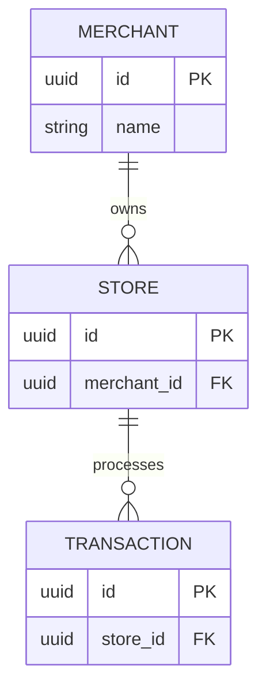

# Database Schema Standard

Version: 1.0  
Status: Released  
Owner: Solution Architect

Contributors (Optional):
- Staff Engineer
- Backend Engineer
- Database Engineer

---

# Purpose

This document defines the Engineering OS standard for database schema design.

A Database Schema is the **source of truth** for data integrity, relationships, and business constraints before implementation begins.

It defines how application data is organized, related, validated, and stored.

**Rule of Thumb:** If a backend engineer can build the database correctly without asking additional questions, this document has succeeded.

---

## Database Information

| System | PRD Reference | System Design | Database Technology | Status |
|----------|---------------|---------------|---------------------|--------|
| `[System Name]` | `[PRD-001]` | `[System-Design-XXX]` | `PostgreSQL` | Draft / Approved |

---

# 1. Global Database Standards

Apply these rules to **every** table unless there is a documented reason not to.

### Primary Keys

- Use `UUID` by default.
- `BIGSERIAL` is acceptable where sequential IDs are preferred.

### Audit Columns

Every persistent business table should include:

```sql
created_at TIMESTAMP WITH TIME ZONE DEFAULT NOW()
updated_at TIMESTAMP WITH TIME ZONE DEFAULT NOW()
deleted_at TIMESTAMP WITH TIME ZONE NULL
```

Exception: Temporary, cache, junction, audit log, or event tables may omit unnecessary audit columns.

### Naming

- Use `snake_case`
- Use plural table names (`users`, `transactions`)
- Use descriptive column names

### Money & Time

- Monetary values must use `DECIMAL` or integer minor units (e.g., cents).
- Never use `FLOAT` for currency.
- Store all timestamps in UTC.

### Indexes

- Index all Foreign Keys.
- Index columns frequently used in filtering, joins, or sorting.

---

# 2. Entity Relationship Diagram (ERD)

**This is the most important section.**

The ERD is the primary source of truth for table relationships.

Use one of:

- Mermaid
- dbdiagram.io
- Draw.io
- Lucidchart

The diagram should include:

- Tables
- Primary Keys
- Foreign Keys
- Relationships
- Cardinality (1:1, 1:N, M:N)

### Example



---

# 3. Table Definition

> Copy this block for every table.

Audit columns are assumed from the Global Database Standards.

---

## `merchants`

**Purpose**

Stores merchant accounts.

| Column | Type | Null | Key / Default | Description & Constraints |
|---------|------|------|---------------|---------------------------|
| id | UUID | No | PK, Generated | Primary identifier |
| name | VARCHAR(100) | No | | Legal business name |
| tax_id | VARCHAR(50) | No | UNIQUE | Government tax identifier |
| status | VARCHAR(20) | No | ACTIVE | Enum: ACTIVE, SUSPENDED |

**Indexes**

- `idx_merchants_tax_id`

**Foreign Keys**

- None

---

## `transactions`

**Purpose**

Stores payment transactions.

| Column | Type | Null | Key / Default | Description & Constraints |
|---------|------|------|---------------|---------------------------|
| id | UUID | No | PK | Primary identifier |
| store_id | UUID | No | FK | References `stores(id)` |
| amount | DECIMAL(10,2) | No | | Transaction amount |
| currency | CHAR(3) | No | USD | ISO-4217 currency |

**Indexes**

- `idx_transactions_store_id`
- `idx_transactions_created_at`

**Foreign Keys**

- `store_id` → `stores(id)` (`ON DELETE RESTRICT`)

---

*(Repeat this section for each remaining table.)*

---

# 4. Engineering Governance

## Writing Rules

- Normalize to 3NF unless there is a documented performance reason not to.
- Keep table and column names consistent.
- Document constraints explicitly.
- The ERD is the primary source of truth for relationships.
- If the data model changes, update this document before the API Specification and implementation.

---

## Definition of Ready (DoR)

- System Design is approved.
- Core business entities are identified.
- Initial ERD is complete.

---

## Definition of Done (DoD)

- ERD is complete.
- All required tables are documented.
- Constraints and indexes are defined.
- Relationships are validated.
- Peer reviewed.
- Approved by the Solution Architect.

---

## Naming Convention

```
Database-Schema-<system-name>.md
```

Examples:

- `Database-Schema-Payment-Gateway.md`
- `Database-Schema-Merchant-Portal.md`
- `Database-Schema-LMS.md`

---

**Changelog:** Tracked via Git history.